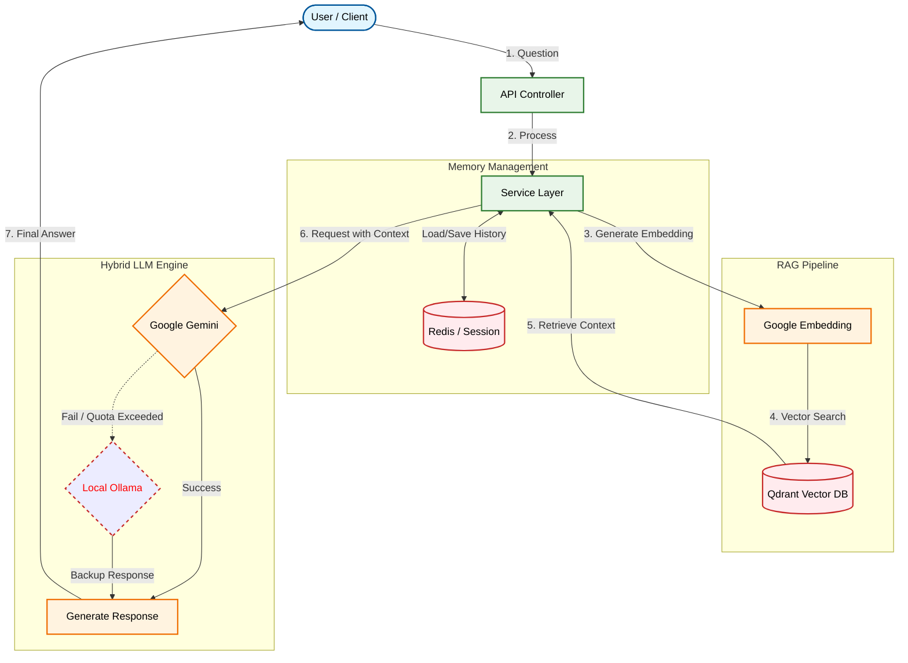

# Portfolio Project

RAG와 Hybrid LLM 전략을 적용한 대화형 포트폴리오 프로젝트

## Overview

사용자가 저의 이력과 기술 스택에 대해 자연어로 질문하고 답변받을 수 있는 AI 에이전트

- Spring AI를 기반으로 RAG(검색 증강 생성) 패턴을 구현
- Gemini API와 로컬 LLM(EXAONE)을 결합한 하이브리드 아키텍처

## Architecture

## Technical Features

1. Robust Fallback Mechanism (Circuit Breaker Pattern)
    - 외부 API(Gemini)는 네트워크 이슈나 토큰 제한으로 인해 언제든 실패할 수 있습니다.
    - try-catch 및 Spring AI의 에러 핸들링을 통해 Gemini 응답 불가 시, 로컬에 호스팅된 EXAONE 3.5 모델로 즉시 전환되는 Failover 로직을 구현했습니다.
2. Domain-Specific RAG Implementation
    - Qdrant를 사용하여 이력서, 프로젝트 경험, 기술 블로그 데이터를 벡터화하여 저장했습니다.
    - 사용자 질문이 들어오면 유사도(Cosine Similarity)가 높은 문서를 검색(Retrieve)합니다.
    - 검색 결과를 시스템 프롬프트에 주입하여 AI가 제 포트폴리오 내용을 기반으로 답변하도록 유도했습니다.
3. Stateful Conversation Management
    - HTTP 요청 간의 상태 비저장을 극복하기 위해, Session ID를 키(Key)로 하는 Redis의 List 자료구조에 대화 내용을 저장합니다.
    - 이전 대화 맥락을 포함하여 LLM에 전송함으로써, "그 프로젝트에서 사용한 기술 스택이 뭐야?"와 같은 지시어 대명사가 포함된 질문도 정확히 처리합니다.

## Tech Stack

### Frontend
| Category | Technology | Version |
| :--- | :--- | :--- |
| **Language** | TypeScript | **5.9.3** |
| **Framework** | React | **19.2.3** |
| **Styling** | Tailwind CSS | **4.1.18** |
| **Build Tool** | Vite | **7.3.0** |
| **Linting** | ESLint | 9.x |

### Backend & AI
| Category | Technology | Version |
| :--- | :--- | :--- |
| **Language** | Java | **25** |
| **Framework** | Spring Boot | **4.0.1** |
| **AI Engine** | Spring AI | 2.0.0-M2 |
| **LLM Model** | Google GenAI / Ollama | - |
| **Vector DB** | Qdrant | - |
| **Database** | Redis | - |